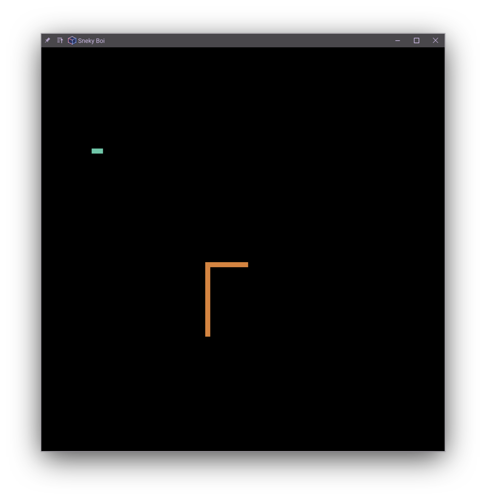

# Snek
A multiplayer snake game written in Pyxel

## Features
- Same keyboard multiplayer (defaults to 3 players)
    - Vim bindings for the 3rd player
- Snakes leave some food behind when they die (20% chance per segment)
- mostly clean, fairly well commented code, should be easy enough to tweak for
  your gaming needs
    - pretty easy to turn it into a bloodbath of a snake game actually, just
      crank `MINIMUM_FOOD` WAAAY up

